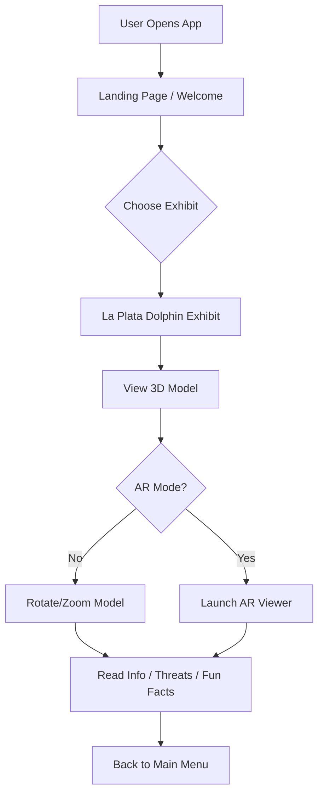
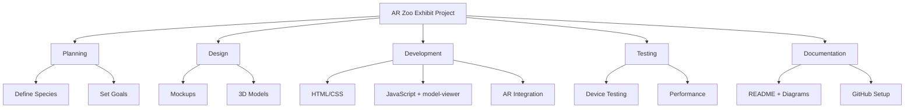

# 🐬 AR Zoo & Museum Exhibit

An interactive prototype that simulates an Augmented Reality Zoo and Museum Exhibit, designed to raise awareness about critically endangered species in Brazil — starting with the La Plata dolphin (*Pontoporia blainvillei*). This project supports the goals of **UN Sustainable Development Goal 15.7** by promoting conservation through immersive educational tools.

> 🇵🇹 Disponível em português e inglês  
> 🇬🇧 Available in Portuguese and English

---

## 🎯 Project Goals

- Educate users about endangered species through engaging AR experiences
- Simulate interactive 3D animal exhibits with contextual information
- Create a GitHub-friendly prototype using open web technologies

---

## 🚀 Getting Started

1. Make sure you have **Node.js** installed.
2. Clone or download the repo.
3. Run the following commands in the root folder:

```bash
npm install
npm start
```

4. A browser tab will open at `http://localhost:1234`

---

## 💡 Technologies Used

- HTML5 + CSS3 + JavaScript (Vanilla + React)
- [`<model-viewer>`](https://modelviewer.dev/) for 3D model display
- [Parcel](https://parceljs.org/) for bundling
- Git + GitHub for version control

---

## 🧠 Project Diagrams

### 📊 Flowchart



### 🧩 Work Breakdown Structure



---

## 📁 Folder Structure

```
AR-Zoo-Exhibit/
├── public/
│   └── index.html
├── src/
│   ├── App.js
│   ├── index.js
│   ├── styles/
│   │   └── main.css
│   └── components/
│       └── AnimalViewer.js
├── assets/
│   ├── models/
│   │   └── placeholder.glb
│   └── mockups/
│       └── dolphin_welcome_screen.png
├── README.md
├── LICENSE
├── package.json
└── .gitignore
```

---

## 📸 References

- 🎨 Mockup image: `assets/mockups/dolphin_welcome_screen.png`
- 🐬 Species focus: La Plata dolphin (*Pontoporia blainvillei*)
- 📚 Source: [IUCN Red List](https://www.iucnredlist.org/)

---

## 📝 License

MIT License — see [`LICENSE`](./LICENSE) for full details.
